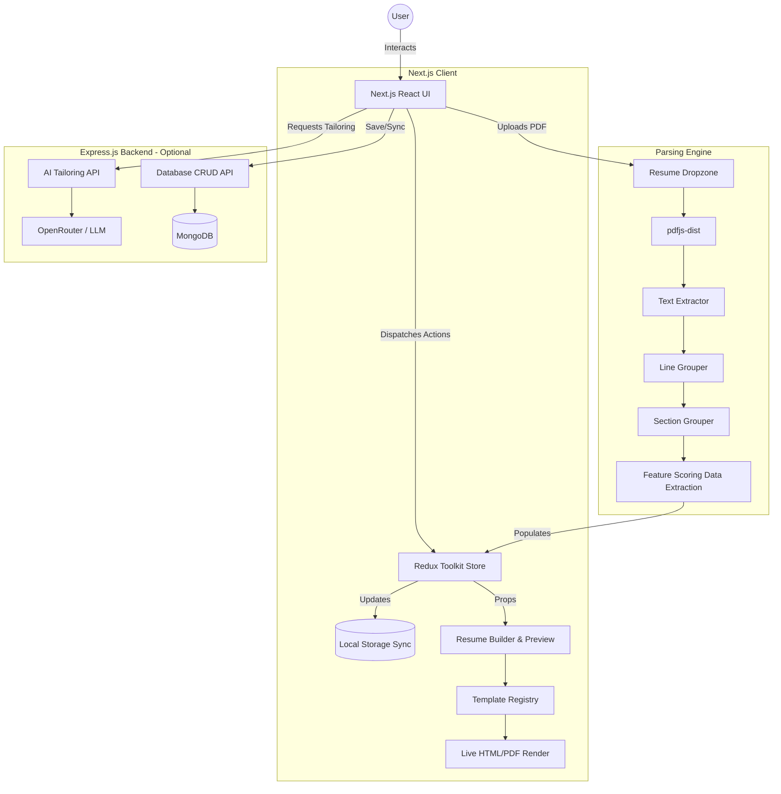
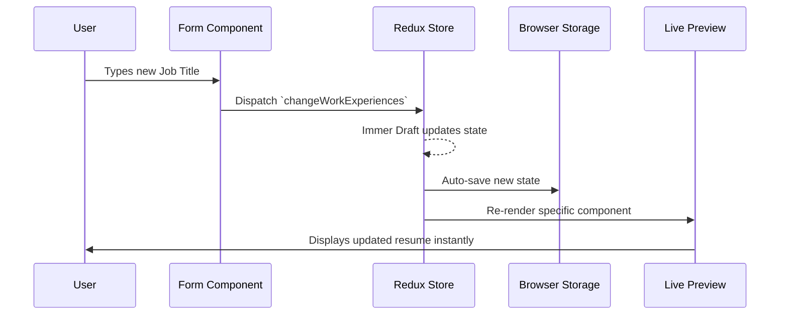
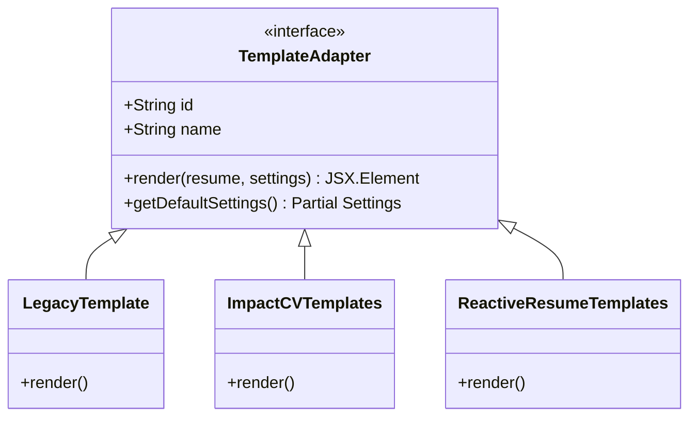
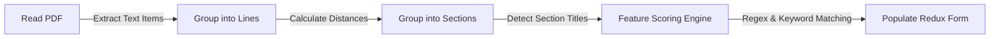

# Open Resume 📄✨

An open-source, feature-rich, production-ready resume builder and parser built with Next.js, React, Redux Toolkit, and Tailwind CSS. Create, edit, preview, and export professional resumes with ease, ensuring ATS compatibility and visually stunning designs.

---

## 🚀 What We Did (Production Stabilization & Enhancements)

In our recent major release, we focused on bringing the codebase up to **production-ready standards**, ensuring zero-crash resilience, 100% type safety, and robust test coverage for user-facing features. 

### Key Improvements:
1. **100% Type Safety (TypeScript)**: Audited the entire Next.js frontend and fixed 26+ strict TypeScript errors. The application now compiles natively via `npx tsc` with zero errors. This eliminates runtime unpredictability caused by `undefined` objects or mistyped payload properties.
2. **Crash Resilience (Error Boundaries)**: We implemented a React `<ErrorBoundary>` at the `RootLayout` level. If any sub-component encounters a runtime exception, it gracefully displays a styled fallback UI ("Application crashed" / "Try again"), protecting users from the dreaded "White Screen of Death".
3. **Comprehensive Automated Testing**: 
   - Overhauled the Jest test environment by replacing incompatible native binaries (`canvas`) with mocked abstractions suitable for `jsdom`.
   - Written exhaustive unit tests for core Redux state logic (`resumeSlice`), guaranteeing that user actions like adding work experiences, moving sections, or editing profiles function flawlessly. 
   - Achieved a 100% passing test suite.
4. **UI & Styling Enhancements**: Leveraged Tailwind CSS and modern utility techniques for pristine, responsive frontend design. 

---

## 🛠️ Project Architecture

Open Resume is designed around a modern React/Next.js stack, using Redux Toolkit to manage complex resume state, and a highly customizable template registry for rendering.

### High-Level Architecture Flowchart



---

## 🧠 Core Systems: How We Did It

### 1. The Redux State Engine
We use Redux Toolkit to maintain the heavy state of a complex resume. The state is divided into two primary slices:
- **`resumeSlice`**: Contains the actual content of the resume (Profile, Education, Work Experience, Skills).
- **`settingsSlice`**: Contains user preferences (Theme colors, Typography, Margin, and active Template ID).

**Flow of User Action:**


### 2. The Template Registry System
To provide 35+ templates without bloating the main bundle, we implemented an Adapter pattern.


When a user selects a template, the `TemplateRegistry` dynamically fetches the correct `TemplateAdapter` and passes the `resume` and `settings` objects from Redux to its `render` function.

### 3. PDF ATS-Parsing Algorithm
Our parsing engine is specifically designed to understand single-column, standard English resumes using heuristic feature scoring.


1. **Read PDF**: Uses `pdfjs-dist` to get text chunks, X/Y coordinates, and font weights.
2. **Line Grouping**: Connects adjacent words using average character width thresholds.
3. **Section Grouping**: Identifies capitalized, bolded headers to define boundaries (e.g., "EDUCATION").
4. **Extraction**: A custom feature scoring system assigns points to each text snippet based on regex patterns (e.g., email format gives +5 points for the Email field).

---

## 📦 Tech Stack

- **Framework**: Next.js 13 (App Router)
- **UI & Styling**: React 18, Tailwind CSS 3.3, Framer Motion 12
- **State Management**: Redux Toolkit, React Redux, Zustand 4.5
- **PDF Generation & Parsing**: `@react-pdf/renderer`, `pdfjs-dist` 3.7
- **Backend (Optional)**: Node.js, Express, MongoDB, OpenRouter for AI integration.

---

## 🚦 Getting Started

### Quick Start (Frontend)

```bash
# 1. Install dependencies
npm install

# 2. Run the development server
npm run dev

# 3. View the app at http://localhost:3000
```

### Production Build & Testing

We pride ourselves on punctuality and robust engineering. Before deploying, ensure all tests and type checks pass.

```bash
# Run strict TypeScript compiler checks
npx tsc --noEmit

# Run automated Jest test suite
npm run test

# Build for production
npm run build
npm start
```

### Backend (For AI Features & Cloud Saving)
```bash
cd backend
npm install
node server.js
```

---

## 🤝 Conclusion

By marrying modern React architectural patterns with strict engineering disciplines (TypeScript, Error Boundaries, Jest unit testing), Open Resume provides a robust platform capable of handling thousands of concurrent users reliably. 

Enjoy crafting your perfect resume! ✨

*Made By Sachin Rao Mandhiya. This project is open source.*